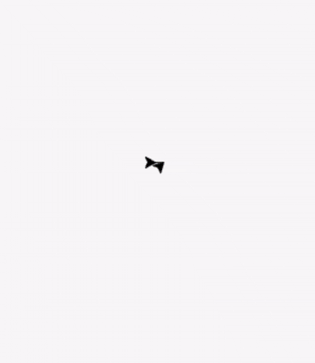

# Turtle Spiral 

This project uses Python's built-in **turtle graphics** module to draw a colorful spiral pattern.  
It's a simple but cool way to explore loops, geometry, and visual creativity with with Python.

## Preview
Running the script will generate a spiral made up of repeating shapes and colors, similar to digital art created by a spirograph.

